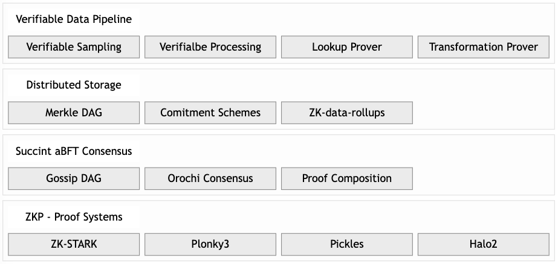

# Architecture

<!-- toc -->

## Component View

We provides robust support for a wide range of commitment schemes and proof systems, making it a standout in secure data infrastructure. It leverages schemes like Merkle trees and polynomial commitments to ensure efficient and verifiable data handling. Additionally, Orochi Network integrates advanced Zero-Knowledge Proof (ZKP) systems such as Halo2, Pickles, ZK-STARK, and Plonky3, offering features like succinctness, scalability, and even post-quantum security. This versatility enhances privacy, interoperability, and efficiency, positioning Orochi Network as a powerful solution for blockchain ecosystems and decentralized applications requiring cutting-edge cryptographic tools.

    
     <b>Figure 1:</b> Orochi Network Architecture

### Verifiable Data Pipeline

Orochi Network goes beyond just data availability. Its verifiable data pipeline offers cryptographic proofs at every step of data processing – from sampling to storage and retrieval. This level of verifiability enhances trust and transparency within blockchain applications.

- **Verifiable Sampling** proves a data sample’s authenticity from an endpoint (e.g., blockchain, API or database). A prover generates a succinct proof to confirm the sample’s integrity (TLS certificate verification) and adherence to a sampling algorithm.
- **Verifiable Processing** is a subsequent step after **Verifiable Sampling**, it proves that raw data has been accurately transformed into structured data per a defined algorithm.
- **Lookup Prove** proves the correctness of a lookup operation over a BTree while linking it to a proof of membership in a commitment scheme, such as a Merkle tree. It ensures that a specific key-value pair retrieved from the BTree exists within the committed dataset, generating a succinct proof that verifies both the lookup’s accuracy and the data’s inclusion.
- **Transformation Prover** proves the correctness of data updates and schema transformations. It ensures that data record is accurately modified—such as through insertions, deletions, or format changes—and aligns with a predefined schema, producing a ZKP tied to a commitment scheme like a Merkle root.

### Distributred Storage

Here’s a concise introduction to the three components of Distributed Storage:

- **Merkle DAG (Directed Acyclic Graph)** A hierarchical structure of hashed nodes that enables content-addressable storage, linking data via cryptographic hashes to ensure integrity and efficient retrieval across distributed systems, with each node verifying its subtree.
- **Commitment Schemes** Cryptographic tools, like Merkle trees or polynomial commitments, that bind data to a single value (e.g., a root hash), allowing provers to confirm authenticity or membership without exposing the full dataset, ensuring trust in a compact form.
- **ZK-Data-Rollups** A scalability solution using Zero-Knowledge Proofs (ZKP) to compress off-chain data updates into succinct on-chain proofs, verifying storage operations efficiently while preserving privacy and enabling high-throughput decentralized storage.

### Succinct aBFT Consensus

Unlike other consensus mechanisms, **Orochi Network’s Succinct aBFT Consensus** achieves fast finality by employing an aBFT approach, tolerating faults while rapidly confirming transactions, and uses ZKP to cryptographically prove the integrity of the entire blockchain state in a compact, verifiable form.

- **Gossip DAG (Directed Acyclic Graph)** A structure that records transactions and messages propagated across nodes in a gossip-based protocol, organizing them into a tamper-evident graph where each node’s hash links to prior events, enabling efficient tracking and validation of network activity.
- **Orochi Consensus** An asynchronous Byzantine Fault Tolerant (aBFT) mechanism tailored for Orochi Network, ensuring agreement among distributed nodes even under adversarial conditions, achieving consensus without relying on synchronous timing assumptions for resilience and speed.
- **Proof Composition** A process that aggregate multiple Zero-Knowledge Proofs (ZKPs) into a single, succinct proof, verifying the correctness of the entire consensus process and blockchain state efficiently, reducing computational overhead for validators and users.

## ZK-Centric Approach

Orochi Network positions as the first Verifiable Data Infrastructure, emphasizing the use of ZKPs for efficient and verifiable data processing. This focus on ZKPs caters to applications requiring high levels of privacy and trust.

- **Proof-System Agnostic** Orochi Network can work with various ZKP systems like Halo2, ZK-STARK, and Pickles, offering developers flexibility in choosing the most suitable proof system for their needs.
- **Blockchain Agnostic** Orochi Network is designed to be blockchain-agnostic, potentially enabling integration with diverse blockchain platforms.
- **Succinct Hybrid aBFT Consensus** This consensus mechanism allows for asynchronous finalization of states, potentially improving efficiency compared to synchronous approaches used by some competitors.
