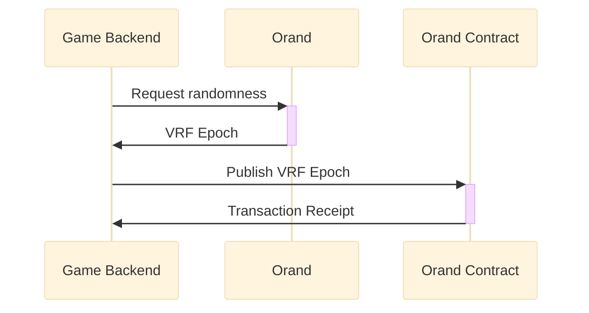
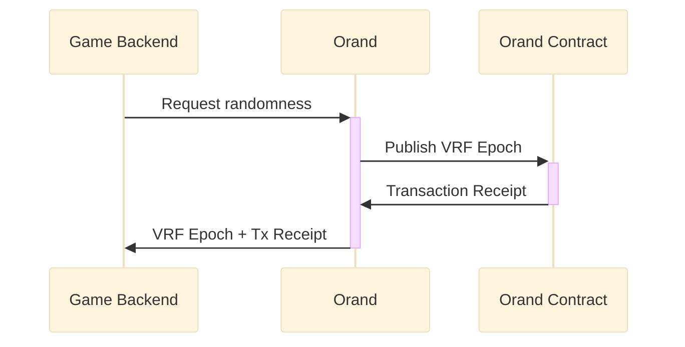
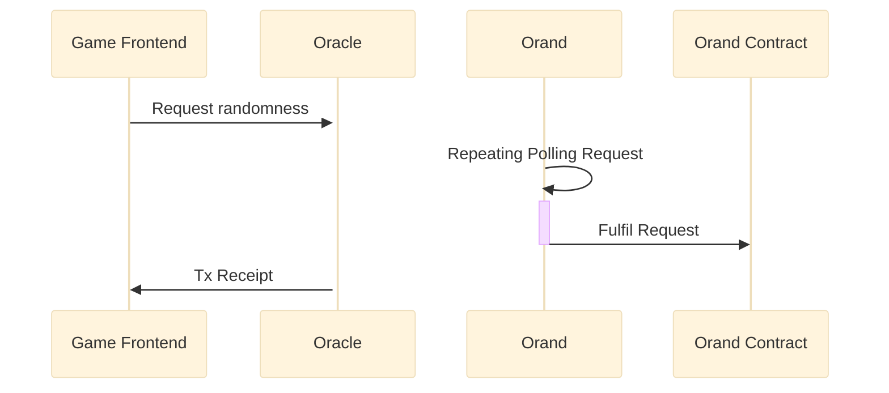

# Orand V2

Orand project was built based on Elliptic Curve Verifiable Random Function (ECVRF). It is deterministic, verifiable and secured based on assumptions from elliptic curves. Administrators of Orochi Network are unable to manipulate the results.

To optimize operation costs and improve security we provided following features:

- **Verifiable:** An Orand's epoch can be verified independently outside our system or can be verified by smart contracts.
- **Self and Delegated Submission:** Orand project have flexibility in proof submission, we just generate valid ECVRF proof and you can decide how to submit them:
  - **Self Submission:** You can request from your back-end to Orand service and submit the randomness to your smart contract.
  - **Delegation Submission:** You can delegate the submission process to Orochi Network by transfer token to our operator, so the feeding process will be performed automatically.
  - **Request Submission:** Instead of request to Orand service, you can request randomness via Oracle contract.
- **Batching:** We allow you to set the batching limit for one epoch, e.g., we can batch `100` randomness for one single epoch which makes the cost be reduced significantly.

## Deployed Platform

Orand V2 was deployed on following smart contract platform.

### Mainnet

| Network Name        | Address                                                                                                                   |
| ------------------- | ------------------------------------------------------------------------------------------------------------------------- |
| Ancient8 Mainnet    | [0x184Ae846c6AC7F7452350AB4Fa81C2cD986c64E1](https://scan.ancient8.gg/address/0x184Ae846c6AC7F7452350AB4Fa81C2cD986c64E1) |
| U2U Solaris Mainnet | [0x8131bE6F2b15Bead0B8D675db9D3d43BFcb3eA72](https://u2uscan.xyz/address/0x8131bE6F2b15Bead0B8D675db9D3d43BFcb3eA72)      |

### Testnet

| Network Name          | Address                                                                                                                             |
| --------------------- | ----------------------------------------------------------------------------------------------------------------------------------- |
| Ancient8 Testnet      | [0x5778CE57f49A5487D2127fd39a060D75aF694e8c](https://scanv2-testnet.ancient8.gg/address/0x5778CE57f49A5487D2127fd39a060D75aF694e8c) |
| Unicorn Ultra Nebulas | [0xe97FE633EC2021A71214D5d9BfF9f337dD1db5c1](https://testnet.u2uscan.xyz/address/0xe97FE633EC2021A71214D5d9BfF9f337dD1db5c1)        |

## Self Submission

User will request the verifiable randomness from Orand service, they can submit the randomness themselves and control gas consumption. You must submit epoch by sequence and starting epoch or genesis must be epoch `0`.

## Delegated Submission

User will delegate the submission process to Orochi Network, first they need to deposit native token to operator address that provided by Orochi Network.

## Request Submission

dApp will request to Orochi Network's oracle contract for the randomness, Orand service will fulfill this request and submit the randomness to Orand provider contract.

## Orand V3

Orand V3 will focus on utilizing Multi Party Computation (MPC) to secure the randomness generation, allowing the whole system to act as one random oracle. It makes the process more dispersed. In this stage, we boot up **Chaos Theory Alliance** to preventing predictability. Everything is built up toward to the vision of **Decentralized Random Number Generator**. If you believe in the vision of **Decentralized Random Number Generator**, please send drop us an email to ([contact@orochi.network](contact@orochi.network)) in order to participate in **Chaos Theory Alliance**.
