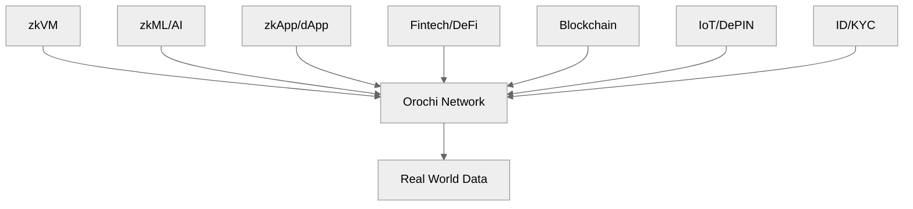

    

# What is Orochi Network?

<!-- toc -->

**Orochi Network** is a **Verifiable Data Infrastructure** designed to ensure data integrity and privacy through advanced cryptographic techniques. Orochi Network provides a secure infrastructure for processing and proving data without compromising confidentiality. This combination of cutting-edge cryptographic primitives allows users to trust the system’s outputs while keeping sensitive information protected, making it a powerful solution for applications requiring both transparency and privacy.

## Introduction

**Orochi Network** is an innovative **Verifiable Data Infrastructure** that redefines how data is handled in the digital age. Built on the principles of security and trustless, it utilizes advanced cryptographic tools like **Zero-Knowledge Proofs (ZKP)**, **Fully Homomorphic Encryption (FHE)**, and **Trusted Execution Environments (TEE)** to guarantee data integrity and privacy. Whether for businesses, developers, or individuals, Orochi Network offers a robust platform where data can be processed and verified securely, ensuring transparency without sacrificing confidentiality. It’s a forward-thinking solution for a world increasingly reliant on trustworthy and private data systems.

At the core of Orochi Network lies its **Verifiable Data Pipeline** and **ZK-Data-Rollups**, two pivotal components that elevate data integrity to new heights. The Verifiable Data Pipeline ensures that every step of data processing is transparent and tamper-proof, while ZK-Data-Rollups harness Zero-Knowledge Proofs to compress and validate data efficiently without revealing sensitive details. Together, these innovations provide a robust foundation for secure, scalable, and privacy-preserving data management, making Orochi Network a trailblazer in delivering trust and reliability in the digital ecosystem.

     <b>Figure 1:</b> Orochi Network turn <b>data</b> to <b>verifiable data</b>, and operating as the backbone of the new internet

## Challenges

### Data Integrity

In a truly decentralized Web3 ecosystem, data integrity would be ensured through a distributed network of aggregators. Each node could independently prove the correctness of data using cryptographic protocols.

However, many Web3 solutions today still rely on oracles, which are fundamentally flawed and unable to guarantee data authenticity. Consequently, smart contracts are often unable to confirm the legitimacy of third-party provided data. This vulnerability leads to potential losses and fraudulent activities.

### Data Availability

Smart contracts run in an isolated environment, such as the EVM or WASM runtime on the blockchain. While this isolation allow smart contract to be executed seamlessly regardless the differences of the architecture, it also limits their ability to directly interact with external data sources, like those in the real world.

Additionally, as the number of users and transactions on a blockchain network grows, storing and accessing all data on-chain becomes increasingly impractical and costly.

### Interoperability

Interoperability is a critical aspect of any decentralized Web3 ecosystem. However, many existing solutions struggle with interoperability due to the lack of standardization and compatibility between different architectures.

Existing DA Layer solution is just a combination of blockchain and commitment schemes and it is failed to prove the DA state to on-chain contracts in a single succinct proof.

### Scalability

Nowadays DA Layers are leveraging existing technical stack that mean they are also inherits issues of existing blockchains, namely finality and scalability. They can not deallocate resource that store on their system and unable to reach instant finality with BFT consensus.

## Our Solutions

### Orochi Network: Verifiable Data Infrastructure

Orochi Network positions as the first Verifiable Data Infrastructure, emphasizing the use of ZKPs for secure and verifiable data processing. This focus on ZKPs caters to applications, platforms requiring high levels of privacy, security and decentralized. Here's a breakdown of our key features and potential of our ZKP centric approach:

- **Native ZK-data-rollups:** Unlike other DA Layers, Orochi Network natively supports ZKPs and perform the rollups on the data. This allows for efficient on-chain verification of data with one single succinct proof, this approach potentially improving scalability and privacy for decentralized applications.
- **Verifiable Data Pipeline:** Orochi Network goes beyond just data availability. We offers cryptographic proofs at every step of data processing – from sampling to storage and retrieval. Our solution is only reply on cryptography protocols that helps to take down third party trust and helping to transform **Real World Data** to **Provable Data** which can be read and verified by smart contracts.
- **Utilizes Merkle Directed Acyclic Graph (Merkle DAG):** Orochi Network leverages Merkle DAG technology, potentially offering advantages over traditional blockchain structures in terms of scalability and performance.
- **Succinct Hybrid aBFT Consensus:** This consensus mechanism allows for asynchronous finalization of states, potentially improving efficiency compared to synchronous approaches used by some competitors.
- **Proof-System Agnostic:** Orochi Network can work with various ZKP systems like Plonky3, Halo2, Nova, and Pickles, offering developers flexibility in choosing the most suitable proof system for their needs.
- **Blockchain Agnostic:** Orochi Network is designed to be blockchain-agnostic by leveraging ZKPs to improve interoperability between different blockchains, potentially enabling integration with diverse blockchain platforms.

## Token Utilities

The native token of Orochi Network, referred to as $ON, serves as the cornerstone of its Verifiable Data Infrastructure, enabling a secure and efficient ecosystem. The token fulfills several critical functions, outlined below:

### 1.Incentivizing Validators

Validators ensure the network’s security and integrity by staking $ON to participate in the consensus process. They are rewarded with $ON based on their contributions, fostering a reliable and decentralized system.

### 2.Distributed Storage

Users can utilize $ON to lease space on Orochi’s distributed storage network, supporting secure and verifiable data management. Fees compensate providers who maintain this infrastructure.

### 3.Rewarding ZK Sequencers

Zero-Knowledge (ZK) sequencers, responsible for processing transactions and ensuring privacy, receive $ON as compensation for their computational efforts, enhancing network scalability.

### 4.Transaction Fees

$ON is used to cover fees for transactions and network interactions, ensuring operational sustainability while providing access to Orochi’s advanced features.

_Through these utilities, $ON drives participation and sustains the Orochi Network, aligning the interests of validators, storage providers, sequencers, and users within a robust economic framework._

## The Future of Web3

Our **Verifiable Data Infrastructure** is a promising step towards a more secure, scalable, and user-friendly Web3. By leveraging the power of Zero-Knowledge Proofs, our Verifiable Data Infrastructure offers solutions to some of the most pressing challenges facing the decentralized future of the internet. As Verifiable Data Infrastructure continues to evolve, it has the potential to be a game-changer for Web3, ushering in a new era of innovation and user adoption.

In essence, our suite of products, anchored by the innovative Verifiable Data Infrastructure, lays the groundwork for a future web built on secure, scalable, and user-friendly decentralized applications. By addressing the limitations of current dApps, Orochi Network has the potential to unlock the true potential of Web3, paving the way for a more decentralized and empowering online experience for everyone. The promise of Orochi Network has been recognized by leading organizations within the blockchain space. Orochi Network is a grantee of the **Ethereum Foundation**, **Web3 Foundation**, **Mina Protocol**, and **Aleo**. This recognition underscores the potential of our technology to shape the future of Web3.

_built with ❤️ and 🦀_
