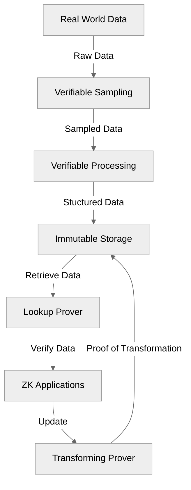

# Verifiable Data Pipeline

Our **Verifiable Data Pipeline** introduces a groundbreaking concept poised to supplant traditional Oracle systems, delivering unparalleled security and reliability. Unlike conventional approaches, it employs proof composition to ensure that every stage of data handling—sampling, processing, lookup, and transformation—is cryptographically verified. This innovative mechanism guarantees that data remains trustworthy and intact throughout its journey, offering a robust alternative to legacy solutions. By redefining how data integrity is maintained, our **Verifiable Data Pipeline** sets a new standard for secure and dependable data management within the Orochi Network.

     <b>Figure 1:</b> Verifibable Data Pipeline

Verifiable Data Pipeline delivers significant value by proving every step of data processing, ensuring verifiable data through the use of Zero-Knowledge Proofs (ZKP) and recursive proofs. This approach guarantees data integrity and authenticity while safeguarding privacy and enabling scalability, meeting the demands of a data-centric landscape.
