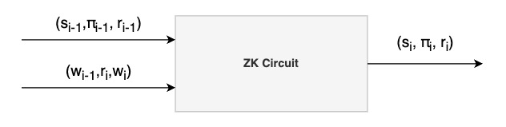
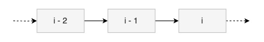

# ZK-data-rollups

**ZK-data-dollups**, a key component of **Orochi Network**, build on the proven ZK-Rollups, widely used to enhance scalability in Layer 2 solutions across Web3. By adapting this approach, ZK-Data-Rollups deliver both security and cost-efficient verification, compressing data's proofs into succinct, cryptographically verified proofs without compromising privacy. This design mirrors the efficiency and trust that ZK-Rollups bring to blockchain transactions, making ZK-data-rollups an ideal solution for secure, low-cost data handling in the Web3 ecosystem, further solidifying Orochi Network’s commitment to innovation and reliability.

    
     <b>Figure 1:</b> ZK-data-rollups circuit

Within ZK-Data-Rollups, each step of data transformation is proven with a Zero-Knowledge Proof (ZKP), ensuring that every stage is secure and verifiable without revealing the data itself. Unlike a single cooperative proof, each ZKP is carried forward and included in the next step of the process, creating a chained sequence of proofs. This step-by-step integration enhances security and maintains rigorous integrity throughout the data transformation pipeline, delivering a highly secure and efficient solution tailored for Web3 applications.

    
     <b>Figure 2:</b> Proof composistion

